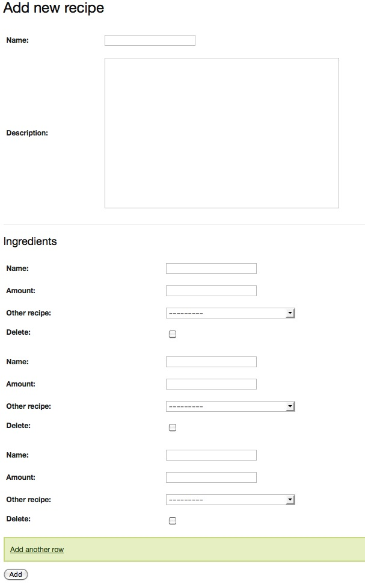

How to: Adding Javascript inlines outside of the admin interface
-----------------------------------------------------------------------

.. topic:: Recipe 72
    
    Run: ``python tools/configure.py -s 72`` to install and run this recipe.

.. sidebar:: Sponsored Recipe

    This recipe was sponsored by `Blue Fountain Systems Ltd`_. Please contact Clearwind_ if you'd like to sponsor a recipe.

In the last two recipes, we've seen how to add inlines through the admin interface. We'll repeat this process in this last recipe of the series but without the admin interface. This uses some different API's and therefore can be slightly different. Again, we'll show a quick snippet of the end result:

The models have remain unchanged since recipe 70. The forms for this setup will also be similar to recipe 70. We'll just need to add in one new form - the Recipe form. This is a basic Django ModelForm:

.. literalinclude:: ../src/recipe_72/forms.py
   :linenos:   

We'll set up two URLs for this recipe, one to add and one to add:

.. literalinclude:: ../src/recipe_72/forms.py
   :linenos:   
   :lines: 5-7
   
The add template is pretty straightforward. We are going to assume that the view is passing a form (the Recipe form) and a formset (the Ingredient formset) to the template. Notice in the template that I've used the same classes from the admin in order to make the Javascript a little bit easier. Each formset is also rendered in its own table. This makes for a slightly ugly markup but it works.

.. literalinclude:: ../src/recipe_72/templates/recipe_72_add.html
   :linenos:   
   :lines: 19-24

When rendering a formset manually in this manner, we also need to include the management form (line 1). This form is the value that gets incremented every time *Add another row* is pressed [#f1]_. The JavaScript is very similar to the one from recipe 72 with a few minor alterations. Since we now have control over the template, the button is rendered in the template not the JavaScript.

Those are all the elements. Now we need to take a look at the main part of this recipe, the views. I covered how to use the *formfield_callback* and *curry* to process the field correctly in recipe 70 . We'll repeat this process in our view. The admin won't be constructing the formset for us this time. We'll have to construct it using an *inlineformset_factory* [#f2]_:

.. literalinclude:: ../src/recipe_72/views.py
   :linenos:   
   :lines: 9-11

Once we've got that formset built, most of the rest of the form is straightforward and follows the standard form population, validation and save process. One slight wrinkle is before the formset can be saved we'll need a recipe to link to it. For this reason, the view populates the formset, validates it, then repopulates it with the saved recipe:

.. literalinclude:: ../src/recipe_72/views.py
   :linenos:   
   :lines: 14-18

There's little difference for the edit page and most of that should be familiar by now. Since we ended up using the *formfield_callback*, it's easy to have these models editable in both *the admin* and *outside the admin*.

.. [#f1] http://docs.djangoproject.com/en/dev/topics/forms/formsets/#using-a-formset-in-views-and-templates
.. [#f2] http://docs.djangoproject.com/en/dev/topics/forms/modelforms/#inline-formsets
.. _Clearwind: http://www.clearwind.ca
.. _Blue Fountain Systems Ltd: http://www.bluefountain.com/